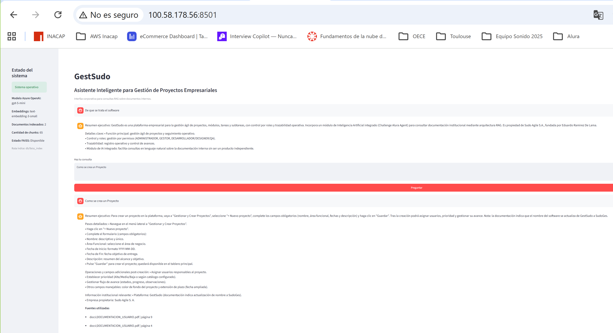

# GestSudo AI

> **Asistente Inteligente Empresarial basado en Retrieval-Augmented
> Generation (RAG)**


 

------------------------------------------------------------------------

# 🚀 Demo en línea

**Aplicación desplegada en Amazon EC2**

**URL pública**

http://100.58.178.56:8501

**Repositorio**

https://github.com/sudoagile/SudoAgile-AI

------------------------------------------------------------------------

  Información       Valor
  ----------------- ------------------------
  Challenge         Alura Latam - IA
  Arquitectura      RAG
  Modelo            GPT-5 Mini
  Embeddings        text-embedding-3-small
  Framework         LangChain
  Base vectorial    FAISS
  Interfaz          Streamlit
  Infraestructura   Amazon EC2
  Estado            Producción

------------------------------------------------------------------------

# Captura de la aplicación



------------------------------------------------------------------------

# Descripción del proyecto

GestSudo AI es un asistente inteligente que implementa una arquitectura
**Retrieval-Augmented Generation (RAG)** para consultar documentación
funcional y técnica mediante lenguaje natural.

La solución integra Azure OpenAI, LangChain, FAISS y Streamlit,
permitiendo obtener respuestas contextualizadas a partir de documentos
PDF indexados.

------------------------------------------------------------------------

# Arquitectura de la solución

``` text
Usuario
   │
   ▼
Streamlit
   │
   ▼
LangChain
   │
 ┌─┴────────────┐
 ▼              ▼
FAISS     Azure OpenAI
   │              │
   └──────┬───────┘
          ▼
Respuesta contextual
```

# Tecnologías

-   Python
-   Streamlit
-   LangChain
-   Azure OpenAI
-   GPT-5 Mini
-   text-embedding-3-small
-   FAISS
-   PyPDFLoader
-   Amazon EC2
-   GitHub

# Estructura del proyecto

``` text
SudoAgile-AI/
├── app.py
├── streamlit_app.py
├── docs/
├── db/faiss_index/
├── src/
├── tools/
└── capturas/
```

# Instalación

``` bash
git clone https://github.com/sudoagile/SudoAgile-AI.git
cd SudoAgile-AI
python -m venv .venv
pip install -r requirements.txt
```

# Variables de entorno

``` env
AZURE_OPENAI_ENDPOINT=
AZURE_OPENAI_API_KEY=
AZURE_OPENAI_CHAT_DEPLOYMENT=
AZURE_OPENAI_EMBEDDING_DEPLOYMENT=
AZURE_OPENAI_CHAT_API_VERSION=
AZURE_OPENAI_EMBEDDING_API_VERSION=
```

# Construcción del índice

``` bash
python app.py
```

# Ejecutar la aplicación

``` bash
streamlit run streamlit_app.py
```

# Despliegue

## Azure OpenAI

-   GPT-5 Mini
-   text-embedding-3-small

### Grupo de recursos


### Implementaciones de modelos


## Amazon EC2

La aplicación se encuentra desplegada en una instancia Ubuntu sobre
Amazon EC2.


# Funcionalidades

-   Consulta de documentación mediante lenguaje natural.
-   Búsqueda semántica con FAISS.
-   Respuestas contextualizadas con Azure OpenAI.
-   Interfaz web desarrollada con Streamlit.
-   Despliegue en la nube sobre AWS EC2.

# Ejemplos

**Pregunta**

> ¿Cómo se crea un proyecto?

**Respuesta**

El asistente identifica la documentación correspondiente, recupera el
contexto más relevante desde el índice FAISS y genera una respuesta
utilizando GPT‑5 Mini.

# Historial de desarrollo

  -----------------------------------------------------------------------
  Nº           Commit                    Objetivo
  ------------ ------------------------- --------------------------------
  1            Creación de la estructura Inicialización del repositorio.
               del proyecto              

  2            Install project           Configuración del entorno.
               dependencies              

  3            Agregar carga de          Carga de documentación PDF.
               documentos                

  4            Implementar división de   Generación de fragmentos
               documentos en fragmentos  (*chunks*).

  5            Actualizar carga de       Optimización del procesamiento
               documentos PDF con        de documentos.
               PyPDFLoader               

  6            Agregar prompt del        Personalización del
               asistente empresarial     comportamiento del agente.

  7            Configurar modelos GPT-5  Integración con Azure OpenAI.
               Mini y Embeddings en      
               Azure                     

  8            Publicar aplicación RAG   Despliegue de la aplicación en
               en AWS EC2 y actualizar   producción.
               README                    

  9            Actualización de la       Incorporación de la
               documentación técnica     documentación final, capturas,
               (README)                  evidencias de despliegue e
                                         instrucciones del proyecto.
  -----------------------------------------------------------------------

# Autor

**Eduardo Ramírez De Lama**

Proyecto desarrollado para el **Challenge Final de Inteligencia
Artificial -- Alura Latam**.

© Sudo Agile S.A.
